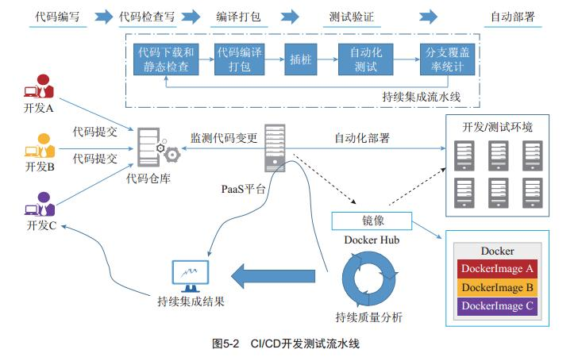
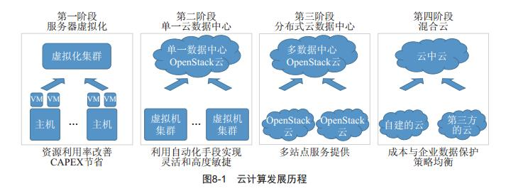

# 第二章 云计算的架构内涵与关键技术
## 2.1 云计算的总体架构

三个层面：

1. 基础设施资源层融合
2. 数据层融合
3. 应用平台层融合

企业IT架构云计算演进中上述三个层次的融合演进，最终目的只有一个，**通过推动企业IT走向极致的敏捷化、智能化以及投入产出比的最优化，使得企业IT可以更好的支撑企业核心业务，进而带来企业业务敏捷性、核心生产力与竞争力的大幅提升，以更加从容应对来自竞争对手的挑战，更轻松应对客户需求的快速多变**

### 2.1.1云计算架构上下文

相关角色：云租户（云业务消费者）、云应用开发者、云服务运营者（服务提供者）、运设备提供者

### 2.1.2云计算的典型技术参考架构

基础设施架构：

1. 物理资源层

2. 虚拟资源层

	- 计算虚拟化
	- 存储虚拟化：小聚大
	- 网络虚拟化

3. 资源服务与调度层

### 2.1.3云计算的服务及管理分层分级架构

### 2.1.4拉通公有云与私有云的混合云架构

## 2.2云计算架构关键技术

### 2.2.1超大规模资源调度算法

1. 计算资源调度算法：负责L2-L5调度

	

2. 存储资源调度算法：

	

3. 能耗管理最优算法

### 2.2.2异构硬件集成管理能力

硬件异构的实现原理图：
	

### 2.2.3应用无关的可靠性保障技术

HA、FT

### 2.2.4单VM及多VM的弹性伸缩技术

基本资源部件级别、虚拟机级别、云系统级别	

### 2.2.5计算近端IO性能加速技术

### 2.2.6网络虚拟化技术

### 2.2.7应用模块以及工作流技术

### 2.2.8容器调度与编排机制

docker公司发布的容器引擎只是单节点上管理容器的守护进程，而企业数据中心或者公有云管理节点的规模庞大，因而一个成熟的容器管理平台还需要一下层面的能力：

- 容器集群资源管理和调度

- 应用编排和管理

	

### 2.2.9混合云适配连接机制

公有云资源作为企业侧的私有云的延伸进行统一管理。混合云架构：
	

##2.3 云计算核心架构竞争力衡量维度

**开源**、**节流**

###2.3.1 低TCO（Total Cost Of Ownership）

###2.3.2 弹性伸缩

###2.3.3 高性能

###2.3.4 领先的用户体验
###2.3.5 高安全
###2.3.6 高可靠

##2.4 云计算解决方案的典型服务与落地架构

# 第二章 云计算及大数据开源软件概览

##3.1 OpenStack概述

开源云操作系统框架

###3.1.1 OpenStack概念辨析

###3.1.2 OpenStack设计与开发

###3.1.2 OpenStack架构与组成

1. Keystone：身份认证与授权服务
2. Nova：计算服务
3. Ironice：裸机管理
4. Glance：镜像服务
5. Swift：对象存储服务
6. Cinder：块存储服务
7. Neutron：网络服务
8. Heat：资源编配服务
9. Ceilometer：监控与计量
10. Horizon：图形界面
11. Sahara：数据处理服务，实现Hadoop Spark等主流大数据处理的云化
12. Magnum：容器服务

##3.2 容器开源软件：Kubernetes/Mesos/Docker

三种容器集群资源管理调度和应用编排

- Mesos生态：核心包括Mesos容器集群资源管理调度和应用管理框架。典型的应用管理框架：**Marathon**（管理长期运行服务）和**Chronos**（管理批量服务） 。Mesosphere和Twitter主推
- Kubernetes生态：涵盖容器集群资源管理调度和不同类型应用管理组件。谷歌主推
- Docker生态：Docker公司希望向容器生态系统上层发展，推出**Swarm**容器资源管理调度以及**Compose**应用编排组件

##3.3大数据开源软件： Hadoop/Spark

Hadoop生态架构：

#4 面向计算资源共享最大化和管理自动化的软件定义计算

虚拟化技术，未完待续

#5面向应用敏捷化部署的Docker容器及其调度

##5.1 容器典型应用场景

###5.1.1互联网web类应用（无状态的web前端适合）

###5.1.2CI/CD开发测试云

###5.1.3微服务管理平台

微服务将应用分解成为一系列相互独立、边界明确、自主完成单一任务的服务，服务之间解耦，可独立替换、升级和伸缩，服务间通过语言无关的轻量级接口如网络通信（RPC、HTTP）、消息队列等进行协同

###5.1.3容器主机

##5.2Docker容器关键技术

###5.2.1 Docker Daemon

###5.2.2 Docker容器

###5.2.3 Docker镜像

###5.2.4 Docker Registry（hub）

##5.3容器操作系统

###5.3.1 CoreOS

###5.3.2 RancherOS

###5.3.3 Snappy Ubuntu Core

###5.3.4 VMware Photon

###5.3.5 Red Hat Atomic Host

###5.3.6 Microsoft Nano Server

##5.4 Docker容器资源管理调度和应用编排

## 5.5Docker容器与软件定义计算的集成

### 5.5.1 Magnum介绍
OpenStack社区推出的用于部署和管理集群的项目，可以方便的通过Magnum来部署和管理Kubernetes Swarm Mesos集群

#6 分布式软件定义存储概述

未完待续

#7 面向自动化、多租户的软件定义网络

未完待续

#8 无边界计算的混合云

云计算的发展历程：

## 8.1混合云的驱动力与背景

管理不同类型的云并能够做最大限度地实现这些云间的资源互助是混合云产生的动因

###8.1.1 混合云对企业的商业价值

- 混合云是解决企业向云平滑演进的有效手段
- 混合云是解决企业使用云技术的有效方式
- 混合云可以帮助企业以最佳成本协同云资源
- 混合云可以防止企业被单一的公有云Lock-in

###8.1.2 混合云典型业务用例

## 8.2 典型的混合云架构模式

### 8.2.1 简单的三层网络互通

### 8.2.2 云中介使能多云管理

### 8.2.3 云网关使能多云资源无缝共享

## 8.3基于OpenStack级联的开放异构混合云

# 9 Paas应用开发平台

##9.1Paas简介

