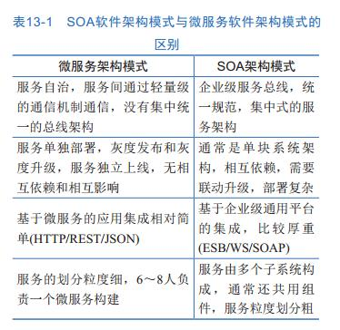

[TOC]

# 2 云计算的架构内涵与关键技术
## 2.1 云计算的总体架构

三个层面：

1. 基础设施资源层融合
2. 数据层融合
3. 应用平台层融合

企业IT架构云计算演进中上述三个层次的融合演进，最终目的只有一个，**通过推动企业IT走向极致的敏捷化、智能化以及投入产出比的最优化，使得企业IT可以更好的支撑企业核心业务，进而带来企业业务敏捷性、核心生产力与竞争力的大幅提升，以更加从容应对来自竞争对手的挑战，更轻松应对客户需求的快速多变**

### 2.1.1云计算架构上下文

相关角色：云租户（云业务消费者）、云应用开发者、云服务运营者（服务提供者）、运设备提供者

### 2.1.2云计算的典型技术参考架构

基础设施架构：

1. 物理资源层

2. 虚拟资源层

	- 计算虚拟化
	- 存储虚拟化：小聚大
	- 网络虚拟化

3. 资源服务与调度层

### 2.1.3云计算的服务及管理分层分级架构

### 2.1.4拉通公有云与私有云的混合云架构

## 2.2云计算架构关键技术

### 2.2.1超大规模资源调度算法

1. 计算资源调度算法：负责L2-L5调度

	

2. 存储资源调度算法：

	

3. 能耗管理最优算法

### 2.2.2异构硬件集成管理能力

硬件异构的实现原理图：
	

### 2.2.3应用无关的可靠性保障技术

HA、FT

### 2.2.4单VM及多VM的弹性伸缩技术

基本资源部件级别、虚拟机级别、云系统级别	

### 2.2.5计算近端IO性能加速技术

### 2.2.6网络虚拟化技术

### 2.2.7应用模块以及工作流技术

### 2.2.8容器调度与编排机制

docker公司发布的容器引擎只是单节点上管理容器的守护进程，而企业数据中心或者公有云管理节点的规模庞大，因而一个成熟的容器管理平台还需要一下层面的能力：

- 容器集群资源管理和调度

- 应用编排和管理

	

### 2.2.9混合云适配连接机制

公有云资源作为企业侧的私有云的延伸进行统一管理。混合云架构：
	

##2.3 云计算核心架构竞争力衡量维度

**开源**、**节流**

###2.3.1 低TCO（Total Cost Of Ownership）

###2.3.2 弹性伸缩

###2.3.3 高性能

###2.3.4 领先的用户体验
###2.3.5 高安全
###2.3.6 高可靠

##2.4 云计算解决方案的典型服务与落地架构

# 3 云计算及大数据开源软件概览

##3.1 OpenStack概述

开源云操作系统框架

###3.1.1 OpenStack概念辨析

###3.1.2 OpenStack设计与开发

###3.1.2 OpenStack架构与组成

1. Keystone：身份认证与授权服务
2. Nova：计算服务
3. Ironice：裸机管理
4. Glance：镜像服务
5. Swift：对象存储服务
6. Cinder：块存储服务
7. Neutron：网络服务
8. Heat：资源编配服务
9. Ceilometer：监控与计量
10. Horizon：图形界面
11. Sahara：数据处理服务，实现Hadoop Spark等主流大数据处理的云化
12. Magnum：容器服务

##3.2 容器开源软件：Kubernetes/Mesos/Docker

三种容器集群资源管理调度和应用编排

- Mesos生态：核心包括Mesos容器集群资源管理调度和应用管理框架。典型的应用管理框架：**Marathon**（管理长期运行服务）和**Chronos**（管理批量服务） 。Mesosphere和Twitter主推
- Kubernetes生态：涵盖容器集群资源管理调度和不同类型应用管理组件。谷歌主推
- Docker生态：Docker公司希望向容器生态系统上层发展，推出**Swarm**容器资源管理调度以及**Compose**应用编排组件

##3.3大数据开源软件： Hadoop/Spark

Hadoop生态架构：

#4 面向计算资源共享最大化和管理自动化的软件定义计算

虚拟化技术，未完待续

#5面向应用敏捷化部署的Docker容器及其调度

##5.1 容器典型应用场景

###5.1.1互联网web类应用（无状态的web前端适合）

###5.1.2CI/CD开发测试云

###5.1.3微服务管理平台

微服务将应用分解成为一系列相互独立、边界明确、自主完成单一任务的服务，服务之间解耦，可独立替换、升级和伸缩，服务间通过语言无关的轻量级接口如网络通信（RPC、HTTP）、消息队列等进行协同

###5.1.3容器主机

##5.2Docker容器关键技术

###5.2.1 Docker Daemon

###5.2.2 Docker容器

###5.2.3 Docker镜像

###5.2.4 Docker Registry（hub）

##5.3容器操作系统

###5.3.1 CoreOS

###5.3.2 RancherOS

###5.3.3 Snappy Ubuntu Core

###5.3.4 VMware Photon

###5.3.5 Red Hat Atomic Host

###5.3.6 Microsoft Nano Server

##5.4 Docker容器资源管理调度和应用编排

## 5.5Docker容器与软件定义计算的集成

### 5.5.1 Magnum介绍
OpenStack社区推出的用于部署和管理集群的项目，可以方便的通过Magnum来部署和管理Kubernetes Swarm Mesos集群

#6 分布式软件定义存储概述

未完待续

#7 面向自动化、多租户的软件定义网络

未完待续

#8 无边界计算的混合云

云计算的发展历程：

## 8.1混合云的驱动力与背景

管理不同类型的云并能够做最大限度地实现这些云间的资源互助是混合云产生的动因

###8.1.1 混合云对企业的商业价值

- 混合云是解决企业向云平滑演进的有效手段
- 混合云是解决企业使用云技术的有效方式
- 混合云可以帮助企业以最佳成本协同云资源
- 混合云可以防止企业被单一的公有云Lock-in

###8.1.2 混合云典型业务用例

## 8.2 典型的混合云架构模式

### 8.2.1 简单的三层网络互通

### 8.2.2 云中介使能多云管理

### 8.2.3 云网关使能多云资源无缝共享

## 8.3基于OpenStack级联的开放异构混合云

# 9 Paas应用开发平台

##9.1Paas简介

传统Paas平台架构：

##9.2基于Docker的新型PaaS

新Paas平台架构：

新Paas平台应提供的功能：

1. 应用编排
2. 容器调度
3. 应用模块（容器）自动伸缩
4. 应用滚动升级
5. 跨云部署应用
6. 对微服务架构的支持
7. 服务治理
8. CI/CD系统

自动化开发流程：

## 9.3消息中间件服务

交互模式归类：

- 一对一还是一对多

- 交互是同步还是一部

一对一有：

请求响应：发出请求，阻塞等待响应

通知（单向请求）：发送请求，不期待回应

请求/异步响应：发送请求，不会阻塞，异步响应请求

一对多有：

发布订阅模式

发布/异步响应模式

## 9.4 数据库和缓存服务

## 9.5 大数据服务

#10 大数据平台核心技术与架构

##10.1 大数据特点与技术支撑

4V Volume Variety Value Velocity

数据采集

数据预处理

数据存储及管理

数据分析及挖掘（重点）

数据展现与应用技术

## 10.2 Hadoop

### 10.2.1 Hadoop起源

### 10.2.2 总体框架

### 10.2.3 HDFS

### 10.2.4 MapReduce

### 10.2.5 ZooKeeper

分布式 高可用的协调服务

- 帮助系统避免单点故障
- 提供分布式协作服务和维护配置信息

### 10.2.6 HBase

### 10.2.7 Hive

### 10.2.8 Spark

## 10.3 流处理技术

## 10.4 大数据在金融领域的探索与实践

# 11企业桌面云接入的关键技术架构与应用

## 11.1 桌面云接入概述

难点：

- 外设兼容性
- 视频体验
- 3D应用
- 网络负载压力
- 安全、部署效率和用户体验

##11.2 桌面云接入的架构

##11.4桌面云接入的关键技术

###11.4.1桌面云协议简介

微软RDP 思杰ICA 红帽的Spice 华为HDP

###11.4.2桌面云协议关键技术：高效远程显示

###11.4.3桌面云协议关键技术：低资源消耗的多媒体视频

###11.4.4桌面云协议关键技术：低时延音频

###11.4.5桌面云协议关键技术：兼容多种外设

# 13 云微服务敏捷治理架构与组织流程

## 13.1 从瀑布式到敏捷式，从服务到微服务

SOA软件架构模式与微服务软件架构模式的区别

##13.2 微服务的治理架构

### 13.2.1 微服务的划分

### 13.2.2 从单块架构像微服务化架构演进

### 13.2.3 微服务开发框架

Spring Cloud

### 13.2.4 微服务的服务发现与注册

### 13.2.5 微服务接口管理

### 13.2.6 微服务依赖关系管理

### 13.2.7微服务的测试

### 13.2.8微服务的运维

### 13.2.9微服务的监控管理

### 13.2.10微服务的故障定位

### 13.2.11微服务的日志管理

## 13.3支撑敏捷开发与上线的微服务CI/CD工具链

###13.3.1微服务的持续集成

###13.3.2微服务的研发工具链

微服务工具集按照领域分为三个大的部分：

1. 微服务开发流水线

	研发团队日常软件开发所使用的工具集，包括构建、测试、部署、验证等环节

2. 研发作业的管理支撑工具
	
	大型软件项目管理工具，包括项目计划、任务分配、任务跟踪，软件的配置管理、版本发布支撑、集成测试等支撑类的工具集

3. 客户界面的运维管理工具

	主要是指软件交付到客户之后的运维工具（例如监控、告警、日志、服务拨测、服务状态管理），客户的问题管理回馈、客户的需求管理工具。

###13.3.3 典型开源社区工具集介绍

##13.4 面向微服务的DevOps研发运维组织变革

#14 云安全架构与应用实践

待续

# 读书有感：

用2-3天闲暇时间读了华为工程师的这本云计算书籍，第一感觉是大而全，第二感觉是有拼凑嫌疑，第三感觉是适合入门科普。这本书涉及的概念繁杂，最近几年的新技术基本都介绍了：云计算、大数据、机器学习、docker、微服务，仔细想想，这些新技术新概念是有联系，作者零散的在各个章节中介绍了一些他们之间的联系。

纵观全书，**第二章**是讲云计算的总体架构及关键技术。**第三章**意欲介绍OpenStack，然而引出了一些开源软件的介绍，实在感觉是不必要。第四章第六章第七章描述了云计算的难点，计算资源、存储、网络的管理调度问题。中间第五章又插入了Docker的介绍，也许作者想Docker是作为计算资源虚拟化、调度管理的一部分吗？我认为这样编排内容不太合适。第八章介绍了混合云。第九章介绍PaaS。第十章开始了大数据的拼凑。第十一章是桌面云，也只是介绍了一下。第十三章开始了微服务的介绍。第十四章又回到了云上，讲了云安全。

总之，我感觉此书作为一个入门读物尚可，但是也难免被其中的混乱结构绕晕。

接下来有几个问题应该思考一下：

- 云计算与大数据的关系？

    答：云计算和大数据是近年来兴起的两个概念，大数据是应用层的东西，当应用层有需求了，需要很强的计算、存储等资源，然而以往的计算机不具备这个能力，云计算技术的出现正好为大数据的发展提供了这一能力。

- OpenStack在云计算中充当的角色是什么？docker在云计算中的地位是怎么样的？
	
	答：OpenStack是目前最为流行的开源云操作系统框架。一个OS应该承担资源的接入与抽象、资源的分配与调度、应用生命周期管理和人机交互支持。Openstack是构建云操作系统的框架，使用云操作系统，集成并管理各类硬件设备，并承载各类上层应用与服务，才能形成一个完整的云计算系统。OpenStack是云计算系统的核心软件组件，是构建云计算系统的基础框架，但是并不能等同。

	docker与openstack经常一起被提起，但其实两者没有什么必然的联系。如上所说，openstack是操作系统层级的，是来管理IT资源的，而docker只是一种虚拟化技术，也可以叫一种软件包的集成技术。两者被联系的一个点是：虚拟化。Openstack需要一种虚拟化技术来抽象计算机资源，现有的什么VM Hypervisor之类的，而docker是一种比虚拟机更轻量级的容器技术，也就是说openstack和docker在虚拟化这一点上可以做集成。

- Paas IaaS Saas之间的区别
 
	答：自己理解，按层级来分，从底向上是IaaS、PaaS、SaaS。Iaas是只给提供操作系统层级的基础设施，不提供应用软件。Paas是帮你集成了数据库、消息队列等等，给你提供了一个平台，你在这个平台的基础上进行软件的开发。而Saas就是，软件都给你开发好了，你就只管用就行了。

	知乎大牛的回答[https://www.zhihu.com/question/21641778](https://www.zhihu.com/question/21641778)

- 微服务与云计算的关系？

	答：这个问题太过牵强，可以直接回答没有关系。微服务是一种新型的构建应用程序的方式，将巨大的单体应用分解成数个小的服务，服务之间相互通过简单的接口来通信，最大的难点就是服务划分的粒度，而微服务的框架也很多，例如Spring Cloud、阿里的dubbo也可以算作是微服务的范畴吧，微服务代表了一种敏捷开发的趋势。

	本书非要介绍微服务感觉是有点牵强，譬如开头讲的软件云化，我觉得并没有什么道理。

- mesos结合docker是否可以用来做Paas层级的东西，是否可以和openstack来比较？