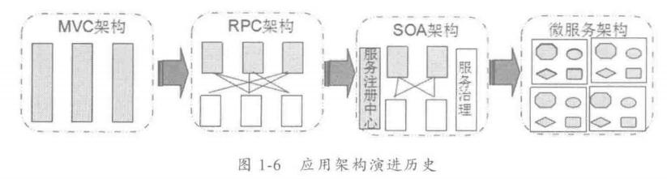
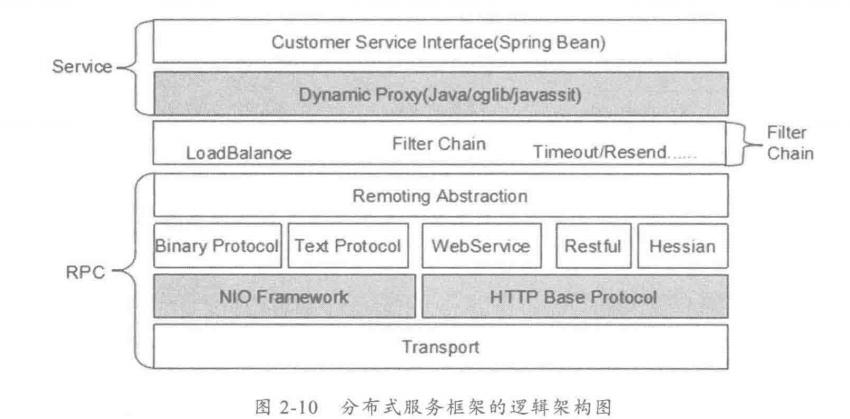
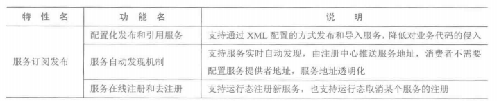
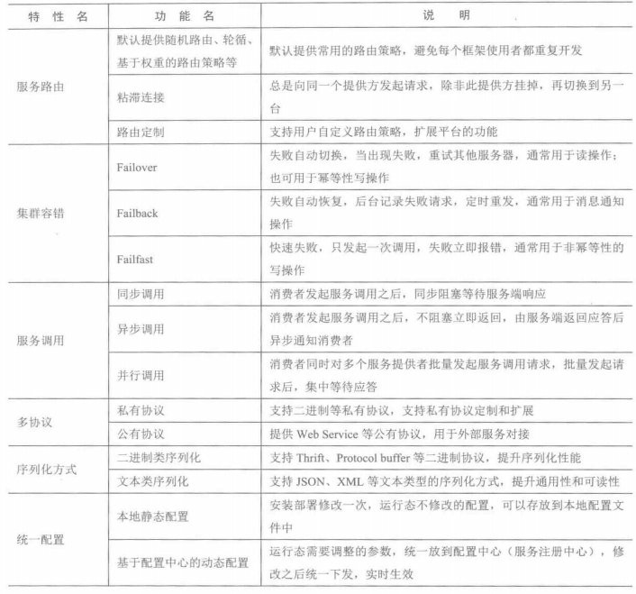

[TOC]

# 第一章 应用框架演进

## 1.1 传统垂直框架

SSH LAMP 双击热备

## 1.2 RPC

技术点：

1. 远程服务提供者需要以某种形式提供服务调用相关的信息，包括但不限于服务接口定义、数据结构、中间态服务定义文件（Thrift GPB）、服务端接口说明文档等
2. 远程代理对象
3. 通信
4. 序列化

## 1.3 SOA服务化

## 1.4 微服务

SOA与微服务的差别（量变引起质变）：

1. 服务拆分粒度：SOA首要解决的是异构应用的服务化，微服务强调的是服务拆分尽可能小，最好是独立的原子服务
2. 服务依赖：SOA由于需要重用已有的资产，存在大量的服务间依赖；微服务设计理念是服务自治、功能单一独立，避免以来其他服务产生耦合
3. 服务规模：SOA服务数量有限，微服务数量巨大，对运维带来新挑战
4. 架构差异
5. 服务治理
6. 敏捷交付：微服务流行设计、开发、部署、线上治理、运维等整个生命周期的支撑，实现真正的DevOps

## 1.5 总结

# 第二章 分布式服务框架入门

## 2.1 诞生背景
- 应用从集中式走向分布式
- 急需服务治理

## 2.2 分布式服务框架介绍

**注意thrift gpb等RPC框架和分布式服务框架的区别**

即：分布式开源框架一定要有一些基础设施来支持分布式服务管理、服务发现注册和服务治理。前者在跨语言调用方面做得还可以

- Dubbo
- HSF
- Coral Service

## 2.3 分布式服务框架设计

通用架构：

功能特性：

# 第三章 通信框架

Netty

# 第四章 序列化和反序列化

功能丰富程度、跨语言支持、兼容性、性能。 Netty内置的编解码器。

# 第五章 协议栈

不同服务在性能上适用于不同的协议进行传输。对接异构的第三方服务时，通常选择HTTP/REST等公有协议；对于内部不同模块之间的服务调用，往往会选择一些性能较高的二进制协议

通信框架、序列化/反序列化、协议栈的关系：协议描述了分布式服务框架的通信契约；序列化和反序列化框架用于协议消息对象和二进制数组之间的相互转换；通信框架在技术上承载协议，协议要落地，需要依赖通信框架提供的基础通信能力

# 总结二三四五章节
[http://blog.jobbole.com/92290/](http://blog.jobbole.com/92290/ "你应该知道的 RPC 原理")

1. 如何调用他人的远程服务

	1.1 如何做到透明化调用远程服务
	
	RPC 1.JDK动态代理 2.字节码生成
	
	1.2 怎么对消息进行编解码？
	
	1.2.1 确定消息数据结构
	
	一般包括 1）接口名称 2）方法名 3）参数类型和参数值 4）超时时间 5）requestID
	
	同理，服务器返回的消息结构一般包括以下内容： 1）返回值 2）状态code 3）requestID
	
	1.2.2 序列化
	
	一旦确定了消息结构，下一步就是要序列化了。序列化是将数据结构或对象转换成二进制串的过程，也就是编码的过程。考虑通用性 性能 可扩展性等。成熟方案有hessian、protobuf、thrift、avro等
	
	1.3 通信
	
	序列化之后，就要进行网络通信了，Netty

2. 如何发布自己的服务

	服务注册、服务发现（zookeeper）

# 第六章 服务路由

使用zookeeper来做注册中心，消费者缓存提供者地址，当注册中心挂掉时候，只影响新服务的注册和老服务的下线，而不影响已经发布和运行的服务

# 第七章 集群容错

通信链路故障、服务端超时、服务端调用失败

FailOver： 失败自动切换，会增大时延，所以必须对失败重试的最大次数做限制，通常为3，防止无限制重试导致服务调用时延不可控

Failback：失败通知，让调用者决定后续选择

Failcache：失败缓存

FailFast：快速失败，对于一些非核心服务，只希望调用一次，失败也不要重试

# 第八章 服务调用

误区1:NIO就是异步服务：

服务是否异步与NIO不是一个层级的东西，NIO或BIO是通信层级的，而业务层级和网路通信层级是可以解耦的，一般用一个queue来解耦达到异步

误区2：服务调用天生就是同步的：

大部分远程调用的应用场景还是同步阻塞的，但是也可以利用Java的Future-Listener机制来实现异步服务调用。从业务角度来看，他的效果与同步等待等价，但是从技术角度，却是很大的进步，可以保证业务线程不同步阻塞的情况下实现同步等待的效果，服务执行效率更高。

- 同步服务调用

- 异步服务调用
	
	异步服务调用基本有Future-Listener和Future-get模式

- 并行服务调用

	一次同时发起多个服务调用，先做流程的Fork，再利用Future主动等待获取结果，进行结果汇聚（join），实现并行服务调用的集中技术方案：

A. JDK 7的Fork/Join，可实现任务的并行执行和结果汇聚

B. BPM的Pareallel Gateway

C. 批量串行服务调用

总结：

服务框架往往需要支持多种形式的调用，在设计服务调用时，需要充分考虑用户的使用习惯以及业务面临的主要挑战，在矛盾中做出平衡和取舍。

# 第九章 服务注册中心

注册中心需要考虑的问题：

1） 高HA：支持数据持久化、支持集群

2） 数据一致性问题： 集群中所有客户端应该看到同一份数据，不能出现读或者写数据不一致的问题

3） 数据变更主动推送： 发生数据变更时，需要及时推送给客户端

#第十章 服务发布和引用

## 10.1 服务发布设计

服务发布设计的几种方式：

1）XML配置化方式

2）注解方式

3）API调用方式

对比如下：

总结：

一个好的分布式服务框架对业务代码的侵入要足够低，例如通过xml配置化的方式将普通的Java接口发布成远程服务；消费者通过配置化的方式引用服务提供者的接口。基于接口编程，服务框架底层无论如何变更都不会影响上层应用，真正实现业务和平台解耦

# 第十一章 服务灰度发布

# 第十二章 参数传递

# 第十三章 服务多版本

# 第十四章 流量控制

# 第十五章 服务降级 

1 屏蔽降级

2 容错降级

# 第十六章 服务优先级调度

# 第十七章 服务治理

# 第十八章 分布式消息跟踪

# 第十九章 可靠性设计

# 第二十章 微服务架构

《微服务设计》

#第二十一章 最佳实践

影响RPC性能的主要三个因素：

1） I/O调度模型，BIO NIO

2） 序列化框架的选择 文本协议？二进制协议？

3） 线程调度模型： 串行调度还是并行调度

-----------------------------------------------------

事务一致性问题（**分布式事务**问题）：

能在业务层避免就要避免。**是个值得研究的问题**

